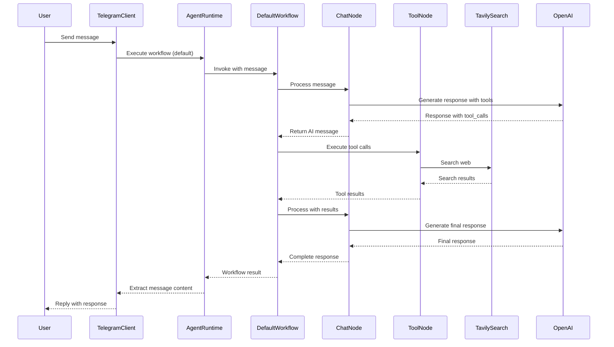
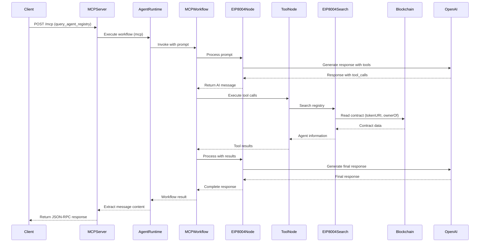
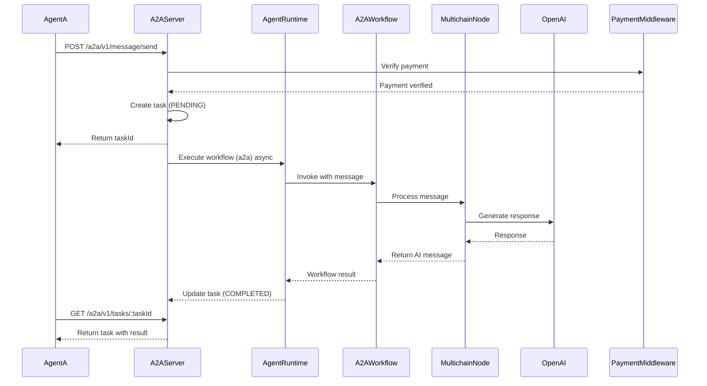

# Basic Agent

A flexible, multi-protocol AI agent runtime built with LangGraph, supporting Telegram, MCP (Model Context Protocol), A2A (Agent-to-Agent), and Agent Card protocols. This agent can be easily extended and customized for various use cases.

## Features

- 🤖 **Multi-Protocol Support**: Telegram bot, MCP server, A2A server, and Agent Card discovery
- 🔄 **LangGraph Workflows**: Modular workflow system with different execution paths
- 🔍 **Tool Integration**: Built-in support for Tavily search and EIP-8004 identity registry queries
- 💬 **OpenAI Integration**: Powered by GPT-4o-mini for conversational AI
- 🔗 **Blockchain Integration**: Query EIP-8004 identity registry on Base Sepolia
- 💰 **Payment Support**: Integrated x402-express middleware for payment processing
- 📋 **Agent Card**: Self-describing manifest following A2A protocol specification

## Architecture

The project follows a modular architecture with clear separation of concerns:

```
src/
├── app/
│   ├── AgentRuntime.ts          # Main runtime orchestrator
│   ├── clients/                  # Client implementations
│   │   └── TelegramClient.ts
│   ├── config/                   # Configuration builders
│   │   ├── AgentCardConfig.ts
│   │   └── EIP8004Config.ts
│   ├── nodes/                    # LangGraph workflow nodes
│   │   ├── chatNode.ts          # Default chat with Tavily search
│   │   ├── eip8004Node.ts       # EIP-8004 registry queries
│   │   ├── multichainNode.ts    # Multichain A2A workflow
│   │   └── interfaces.ts
│   ├── servers/                  # Server implementations
│   │   ├── AgentCardServer.ts   # Agent Card discovery server
│   │   ├── MCPServer.ts         # MCP protocol server
│   │   ├── A2AServer.ts         # A2A protocol server
│   │   └── A2ATypes.ts          # A2A type definitions
│   └── tools/                    # LangChain tools
│       ├── eip8004Search.ts     # EIP-8004 registry search tool
│       └── index.ts
└── index.ts                      # Application entry point
```

### Workflows

The agent supports three distinct workflows:

1. **Default Workflow** (`telegram`): Conversational AI with Tavily web search
2. **MCP Workflow** (`mcp`): EIP-8004 identity registry queries
3. **A2A Workflow** (`a2a`): Multichain agent-to-agent communication

## Installation

### Prerequisites

- Node.js 18+ 
- pnpm 10.6.5+ (or npm/yarn)
- TypeScript 5.9+

### Setup

1. Clone the repository:
```bash
git clone <repository-url>
cd basic-agent
```

2. Install dependencies:
```bash
pnpm install
```

3. Create a `.env` file in the root directory:
```env
# Required
OPENAI_API_KEY=your_openai_api_key_here

# Optional - for Telegram bot
TELEGRAM_BOT_TOKEN=your_telegram_bot_token_here

# Optional - for Agent Card configuration
AGENT_NAME=basic-agent
AGENT_VERSION=1.0.0
AGENT_DESCRIPTION=Your agent description
AGENT_HOSTNAME=localhost
AGENT_URL=http://localhost:3000
AGENT_STREAMING=false
```

4. Build the project:
```bash
pnpm build
```

## Usage

### Development Mode

Run the agent in development mode with hot reload:

```bash
pnpm dev
```

This starts all servers:
- **Agent Card Server**: `http://localhost:3000/.well-known/agent-card.json`
- **MCP Server (SSE)**: `http://localhost:8001/mcp`
- **A2A Server**: `http://localhost:3001/a2a/v1`
- **Telegram Bot**: Active if `TELEGRAM_BOT_TOKEN` is set

### Production Mode

1. Build the project:
```bash
pnpm build
```

2. Start the agent:
```bash
pnpm start
```

### Customizing the Entry Point

You can customize which servers to start by modifying `src/index.ts`:

```typescript
import { AgentRuntime } from "./app/AgentRuntime";

const agentRuntime = new AgentRuntime();

// Register only the services you need
agentRuntime.registerTelegramClient();
agentRuntime.createAgentCardServer(3000);
agentRuntime.createMCPServer("sse", 8001);
agentRuntime.createA2AServer(3001);
```

## API Documentation

### Agent Card Server

The Agent Card Server exposes a self-describing manifest at the well-known URI:

**Endpoint**: `GET /.well-known/agent-card.json`

**Response**: JSON object following the A2A Agent Card specification

**Example**:
```bash
curl http://localhost:3000/.well-known/agent-card.json
```

### MCP Server

The MCP Server exposes a tool for querying the EIP-8004 registry:

**Endpoint**: `POST /mcp`

**Transport**: SSE (Server-Sent Events) or stdio

**Tool**: `query_agent_registry`
- **Description**: Search and retrieve information about agents registered in an EIP-8004 registry
- **Parameters**: `{ prompt: string }`

**Example** (using curl):
```bash
curl -X POST http://localhost:8001/mcp \
  -H "Content-Type: application/json" \
  -H "Accept: application/json, text/event-stream" \
  -d '{
    "jsonrpc": "2.0",
    "id": 1,
    "method": "tools/call",
    "params": {
      "name": "query_agent_registry",
      "arguments": {
        "prompt": "Find agent with ID 1"
      }
    }
  }'
```

### A2A Server

The A2A Server implements the Agent-to-Agent protocol v0.3.0:

**Base URL**: `http://localhost:3001/a2a/v1`

**Core Endpoints**:
- `POST /a2a/v1/message/send` - Send a message to the agent
- `GET /a2a/v1/tasks/:taskId` - Get task status
- `POST /a2a/v1/tasks/:taskId/cancel` - Cancel a task

**Optional Endpoints**:
- `GET /a2a/v1/tasks` - List tasks
- `POST /a2a/v1/message/stream` - Stream messages (not yet implemented)
- `GET /a2a/v1/agent/getAuthenticatedExtendedCard` - Get extended agent card

#### Payment Configuration

The A2A server supports optional payment middleware. You can control it via:

1. **Environment variable** (in `.env`):
   ```env
   A2A_REQUIRE_PAYMENT=true   # Enable payment
   A2A_REQUIRE_PAYMENT=false  # Disable payment
   ```

2. **Code parameter**:
   ```typescript
   await agentRuntime.createA2AServer(3001, true);   // With payment
   await agentRuntime.createA2AServer(3001, false); // Without payment
   ```

#### Examples

**1. Send a message (HTTP+JSON/REST)**:

This creates a new task and returns a `taskId`:

```bash
curl -X POST http://localhost:3001/a2a/v1/message/send \
  -H "Content-Type: application/json" \
  -d '{
    "message": {
      "role": "user",
      "parts": [
        {
          "type": "text",
          "text": "Hello, how are you?"
        }
      ]
    }
  }'
```

**Response**:
```json
{
  "taskId": "task-1234567890-1"
}
```

**2. Get task status and result**:

Use the `taskId` returned above to check the task status and retrieve the result:

```bash
# Replace TASK_ID with the taskId you received
curl -X GET http://localhost:3001/a2a/v1/tasks/TASK_ID
```

**Example**:
```bash
curl -X GET http://localhost:3001/a2a/v1/tasks/task-1234567890-1
```

**Response** (when task is completed):
```json
{
  "taskId": "task-1234567890-1",
  "status": {
    "taskId": "task-1234567890-1",
    "state": "completed",
    "messages": [
      {
        "role": "user",
        "parts": [
          {
            "type": "text",
            "text": "Hello, how are you?"
          }
        ]
      },
      {
        "role": "assistant",
        "parts": [
          {
            "type": "text",
            "text": "Agent response..."
          }
        ],
        "timestamp": "2024-01-01T12:00:00.000Z"
      }
    ],
    "artifacts": [
      {
        "id": "artifact-task-1234567890-1-1234567890",
        "type": "text",
        "mimeType": "text/plain",
        "data": "Agent response..."
      }
    ]
  },
  "createdAt": "2024-01-01T12:00:00.000Z",
  "updatedAt": "2024-01-01T12:00:00.000Z"
}
```

**3. Complete workflow example (bash script)**:

```bash
#!/bin/bash

# Step 1: Send a message
echo "Sending message..."
RESPONSE=$(curl -s -X POST http://localhost:3001/a2a/v1/message/send \
  -H "Content-Type: application/json" \
  -d '{
    "message": {
      "role": "user",
      "parts": [
        {
          "type": "text",
          "text": "What is the capital of France?"
        }
      ]
    }
  }')

# Extract taskId
TASK_ID=$(echo $RESPONSE | grep -o '"taskId":"[^"]*' | cut -d'"' -f4)
echo "Task ID: $TASK_ID"

# Step 2: Wait for task to complete
echo "Waiting 3 seconds..."
sleep 3

# Step 3: Get result
echo "Retrieving result..."
curl -X GET http://localhost:3001/a2a/v1/tasks/$TASK_ID | jq '.'
```

**4. Send message using JSON-RPC 2.0**:

```bash
curl -X POST http://localhost:3001/a2a/v1 \
  -H "Content-Type: application/json" \
  -d '{
    "jsonrpc": "2.0",
    "id": 1,
    "method": "message/send",
    "params": {
      "message": {
        "role": "user",
        "parts": [
          {
            "type": "text",
            "text": "Hello, how are you?"
          }
        ]
      }
    }
  }'
```

**5. List all tasks**:

```bash
curl -X GET "http://localhost:3001/a2a/v1/tasks?limit=10"
```

**6. Cancel a task**:

```bash
curl -X POST http://localhost:3001/a2a/v1/tasks/TASK_ID/cancel
```

## Sequence Diagrams

### Default Workflow (Telegram/General Chat)



### MCP Workflow (EIP-8004 Registry Query)



### A2A Workflow (Agent-to-Agent Communication)



## Configuration

### Environment Variables

| Variable | Required | Description | Default |
|----------|----------|-------------|---------|
| `OPENAI_API_KEY` | Yes | OpenAI API key for LLM | - |
| `TELEGRAM_BOT_TOKEN` | No | Telegram bot token | - |
| `AGENT_NAME` | No | Agent name for Agent Card | `basic-agent` |
| `AGENT_VERSION` | No | Agent version | `1.0.0` |
| `AGENT_DESCRIPTION` | No | Agent description | Auto-generated |
| `AGENT_HOSTNAME` | No | Hostname for Agent Card | `localhost` |
| `AGENT_URL` | No | Base URL for Agent Card | `http://localhost:3000` |
| `AGENT_STREAMING` | No | Enable streaming support | `false` |
| `PORT` | No | Port for Agent Card server | `3000` |
| `A2A_REQUIRE_PAYMENT` | No | Enable payment middleware for A2A server | `false` |

### EIP-8004 Configuration

The EIP-8004 configuration is defined in `src/app/config/EIP8004Config.ts`:

- **Contract Address**: `0x8004AA63c570c570eBF15376c0dB199918BFe9Fb`
- **Chain**: Base Sepolia
- **Functions**: `tokenURI`, `ownerOf`

To modify the configuration, edit the `EIP8004_CONFIG` constant.

## Development

### Project Structure

- **Source Code**: `src/` - TypeScript source files
- **Compiled Output**: `dist/` - JavaScript output (generated)
- **Configuration**: `tsconfig.json` - TypeScript configuration

### Adding a New Workflow

1. Create a new node in `src/app/nodes/`:
```typescript
import { LLMNode } from "./interfaces";
import { MessagesAnnotation } from "@langchain/langgraph";

export const myCustomNode: LLMNode = async (state) => {
    // Your node implementation
    return { messages: [/* ... */] };
};
```

2. Define the workflow in `AgentRuntime.ts`:
```typescript
private defineMyWorkflow() {
    return new StateGraph(MessagesAnnotation)
        .addNode("myNode", myCustomNode)
        .addEdge(START, "myNode")
        .addEdge("myNode", END)
        .compile();
}
```

3. Register the workflow:
```typescript
constructor() {
    // ...
    this.workflows.set('myworkflow', this.defineMyWorkflow());
}
```

### Adding a New Tool

1. Create a tool in `src/app/tools/`:
```typescript
import { tool } from "langchain";
import * as z from "zod";

export const myTool = tool(
    async (input: unknown) => {
        // Your tool implementation
        return "result";
    },
    {
        name: "my_tool",
        description: "Tool description",
        schema: z.object({ /* ... */ }),
    }
);
```

2. Export it from `src/app/tools/index.ts`:
```typescript
export { myTool } from "./myTool";
```

3. Use it in a node:
```typescript
import { myTool } from "../tools";

const tools = [myTool] as any;
const llmWithTools = llm.bindTools(tools);
```

### Adding a New Server

1. Create a server class in `src/app/servers/`:
```typescript
export class MyServer {
    public async start(): Promise<void> {
        // Server implementation
    }
}
```

2. Add a method to `AgentRuntime`:
```typescript
public async createMyServer(port: number): Promise<void> {
    this.myServer = new MyServer(/* ... */);
    await this.myServer.start();
}
```

## Contributing

Contributions are welcome! Here are some ways you can help:

1. **Report Bugs**: Open an issue describing the bug
2. **Suggest Features**: Share your ideas for new features
3. **Submit Pull Requests**: Implement improvements or fixes
4. **Improve Documentation**: Help make the docs clearer

### Development Workflow

1. Fork the repository
2. Create a feature branch: `git checkout -b feature/my-feature`
3. Make your changes
4. Test thoroughly
5. Commit: `git commit -m "Add my feature"`
6. Push: `git push origin feature/my-feature`
7. Open a Pull Request

### Code Style

- Follow TypeScript best practices
- Use meaningful variable and function names
- Add JSDoc comments for public APIs
- Ensure all code is properly typed
- Run `pnpm build` before committing

## License

ISC

## Acknowledgments

- [LangChain](https://github.com/langchain-ai/langchain) - LLM framework
- [LangGraph](https://github.com/langchain-ai/langgraph) - Workflow orchestration
- [Model Context Protocol](https://modelcontextprotocol.io/) - MCP specification
- [A2A Protocol](https://github.com/agentic-ai/a2a-spec) - Agent-to-Agent protocol
- [OpenAI](https://openai.com/) - LLM provider
- [Viem](https://viem.sh/) - Ethereum library
- [Telegraf](https://telegraf.js.org/) - Telegram bot framework

## Support

For questions, issues, or contributions, please open an issue on the repository.

